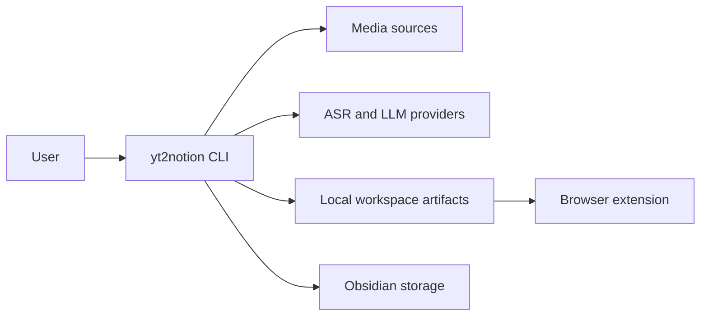
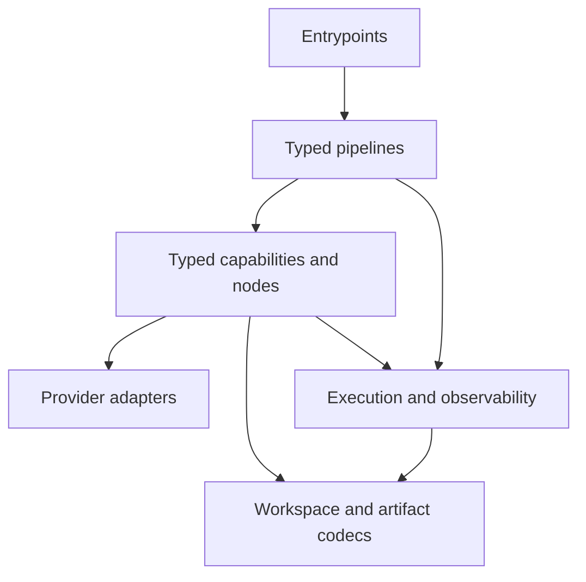
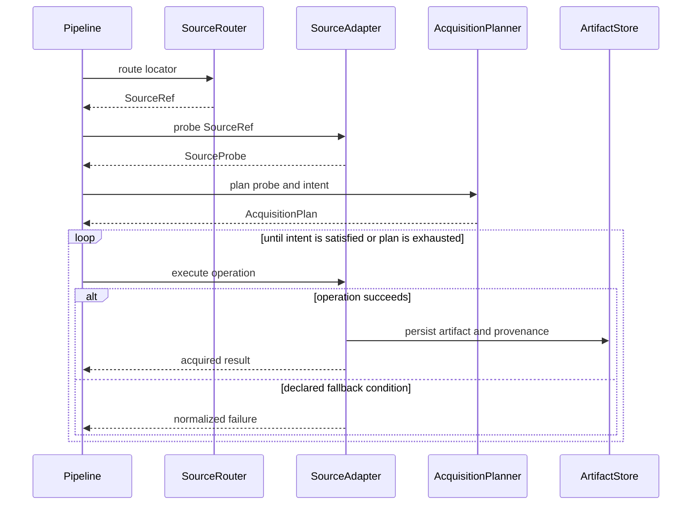
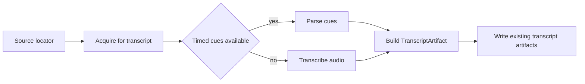
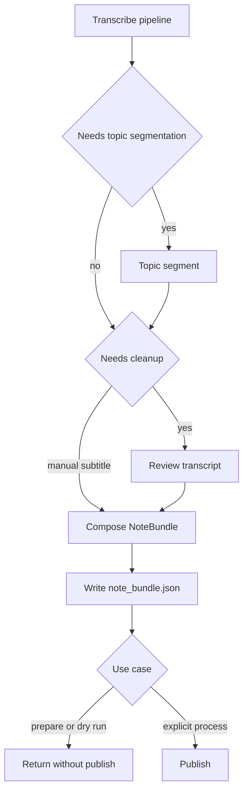
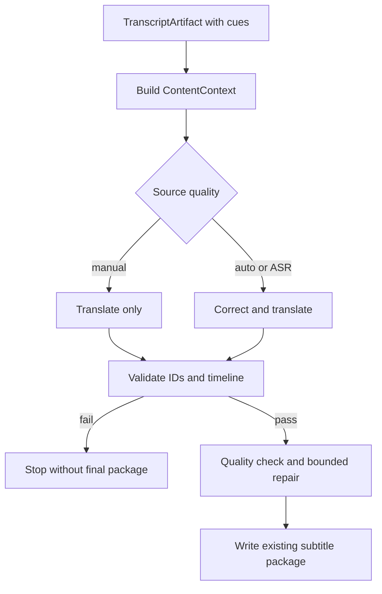
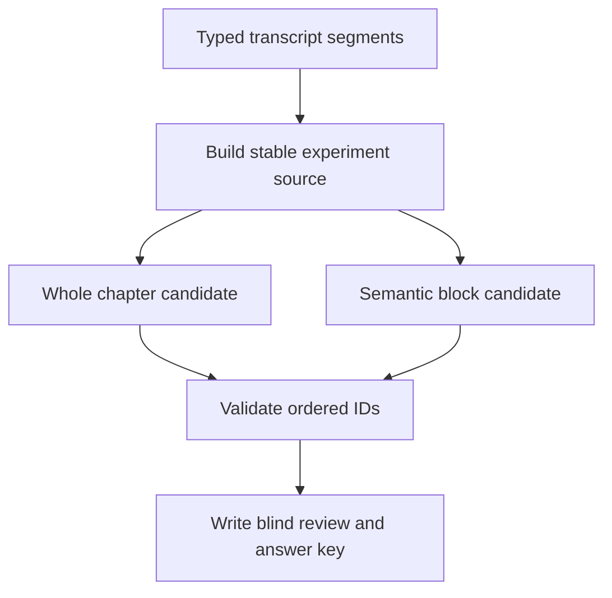
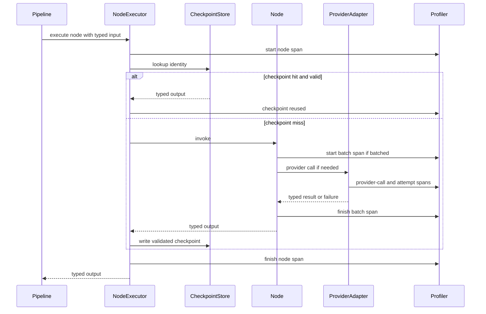
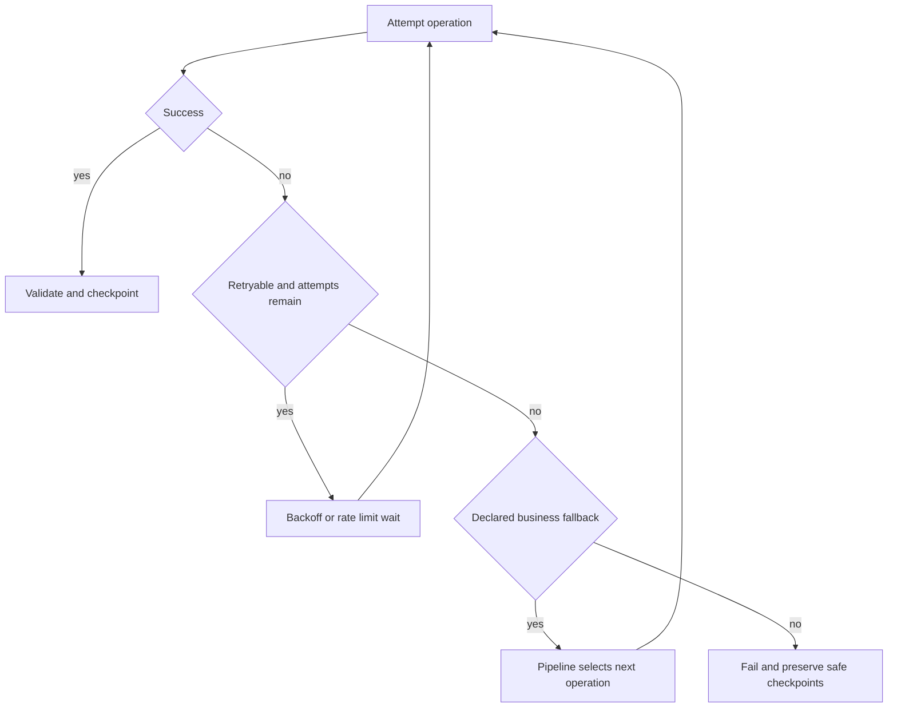

# yt2notion Typed Pipeline 目标架构

> **文档性质：目标架构提案。** 本文不描述已经落地的事实。当前 pipeline、artifact、配置与扩展点仍以 [`PROJECT_MAP.md`](../PROJECT_MAP.md) 为唯一事实锚点；只有完成迁移的行为才能回写其中。

## 1. 要解决的架构问题

yt2notion 已经从单一路径发展出转录、笔记、双语字幕包和翻译实验等用例。下一阶段需要让这些用例复用同一组可靠能力，而不是继续在应用服务中复制编排、恢复和观测逻辑。

当前代码给出三类直接证据：

- 核心转录路径仍以 `list[dict]` 在 segmentation、transcription、review、workspace 之间传递数据，反序列化后缺少统一类型与校验边界。
- `MediaSource.acquire()` 同时承担探测、来源选择、下载和 fallback，provider 操作与业务选择难以分别测试。
- subtitle-pack 和 translation experiment 已各自实现 typed model、checkpoint 或 profile，证明这些模式有价值，也说明共享机制尚未形成。

因此，本设计只解决一个核心问题：**把稳定的业务能力做成 typed nodes，由几条普通 Python pipeline 按用例组合；provider adapter 位于其下，执行、观测和恢复机制位于其侧。**

> 实现状态（2026-09-19）：Phase 1–3 已落地 typed transcript spine、acquisition split 与共享 runtime/checkpoint/retry 边界。为表达嵌套 parentage 和 interruption，subtitle profile 已明确升级为 schema v2；业务 artifact 与 checkpoint schema 保持不变。Phase 4 的 ordinary Python pipeline composition 尚在进行。

### 已确定的约束

- pipeline 是普通 Python 函数，使用 `if`、`for` 和函数调用表达流程。
- 不引入通用 DAG runtime、YAML workflow DSL 或动态 node registry。
- adapter 负责外部调用和错误归一化；pipeline 负责业务顺序与业务 fallback。
- runtime 提供执行机制，但不拥有拓扑，也不自行选择业务降级。
- 自动测试只做离线 contract tests，不访问 YouTube、ASR、LLM 或真实 Obsidian vault。
- 初始迁移保持现有行为、文件名和 JSON schema。
- 第一个实现目标是移除核心路径的 `list[dict]` 与 translation experiment cast。

## 2. 系统上下文：边界在哪里

这不是一个新的分布式系统。部署边界仍是本地 CLI；图的目的只是说明它与用户、provider 和 workspace 的关系。

关键边界：

- 用户选择 use case，并且只有显式 `process` 可以进入发布路径。
- 外部系统均通过 adapter 访问；业务代码不解析 provider 原始响应。
- workspace 是本地恢复与产物边界，不是工作流数据库。
- browser extension 只消费稳定字幕包，不参与生成 pipeline。

## 3. 仓库组件：职责如何分开

目标结构按职责分层，而不是要求一次性移动目录。

### 3.1 Entrypoints

CLI 和 application facade 只负责：

- 解析参数并得到 validated config；
- 组装显式依赖；
- 选择一条 pipeline；
- 将 typed progress event 渲染成人类或 JSON 输出。

它们不决定字幕优先级、ASR fallback、checkpoint reuse 或 publish retry。

### 3.2 Typed pipelines

每条 pipeline 是一个可直接阅读和测试的 Python 函数。它拥有：

- node 调用顺序；
- 基于 typed result 的条件分支；
- 改变来源、provider 或质量等级的业务 fallback；
- 是否允许 publish 的用例边界。

pipeline 不处理 provider 请求格式，也不自己实现 backoff、计时或 JSON I/O。

### 3.3 Typed capabilities and nodes

node 是有业务意义、可组合且可独立验证的能力，不是每个 helper 的统一包装。目标只需要以下能力组：

| 能力组 | 责任 | 代表性 node |
|---|---|---|
| Source acquisition | 将内容需求转换为可追溯的本地输入 | route、probe、plan、acquire |
| Transcript | 建立时间轴与阅读单元，完成 ASR、分段和校对 | transcribe、assemble、topic-segment、review |
| Content transformation | 从 typed transcript 生成上下文、笔记、翻译或实验候选 | build-context、compose、translate |
| Validation and artifacts | 确定性验证并写入既有 artifact contract | validate、write-artifact |
| Publication | 在显式授权后写入外部存储 | publish-note-bundle |

一个 node 可以是函数或 callable object；本设计不要求公共基类。只有输入、输出、不变量、side effect 和可恢复边界需要明确。

### 3.4 Provider adapters

adapter 通过 `Protocol` 和显式 factory 提供 source、ASR、LLM、storage 操作。它负责：

- provider 请求、响应解析和凭据使用；
- 将 provider 错误归一化为业务层可判断的失败类别；
- 返回 typed observation 或带 provenance 的结果；
- 暴露执行某项操作的能力，而不是决定何时执行。

subtitle、audio、video 下载属于 source adapter 的不同 operation，不需要变成独立业务 node。ASR backend 切换、从字幕来源降级到音频等业务选择，由 pipeline 或 acquisition plan 决定。

### 3.5 Runtime 与 artifact 边界

runtime 包含 `NodeExecutor`、profiler、retry、checkpoint 和 provider availability observation。它只提供机制。`Workspace` 管理本地运行目录；artifact codec 在 JSON/文件与 domain object 之间做 validation 和转换。

兼容性留在 codec：domain 不应为了旧 JSON 保留无意义的 dict 形状，codec 则必须在初始迁移中继续读写现有 schema。

## 4. 最小 typed contracts

目标不是预先冻结所有字段，而是先确定跨边界必须表达的语义。

### 4.1 来源与获取

- `SourceRef`：已经路由到某类 source adapter 的稳定来源引用，同时保留用户输入。
- `SourceProbe`：一次带时间点的 metadata 与 capability 观察；capability 表示“观察到可用”，不是执行成功保证。
- `AcquisitionIntent`：pipeline 对 timed cues、audio、video 等结果的业务需求，不包含 yt-dlp 参数。
- `AcquisitionPlan`：根据 probe 与 intent 产生的有序操作及允许的 fallback 条件。
- `AcquiredMedia`：获取到的本地 artifact、source metadata 与 provenance；不能靠路径是否为 `None` 猜测来源。

### 4.2 Transcript 与内容

- `SegmentSpec`：章节或 ASR 工作区间，只描述结构，不承载 transcript text。
- `TranscriptCue`：最小时间轴证据，拥有稳定 ID、时间范围、文本和来源。
- `TranscriptSegment`：面向阅读、校对和总结的聚合单元，可由多个 cue 组成。
- `TranscriptArtifact`：将 source metadata、ordered cues、ordered segments 和来源信息作为一个受验证结果传递。
- `ContentContext`：内容生成所需的有界上下文及其来源指纹，不持有 provider client。

`TranscriptCue` 与 `TranscriptSegment` 必须分开：topic segmentation 或 review 可以重组、改写 segment，但不能静默改动播放时间轴证据。

### 4.3 验证、质量与持久化

- deterministic validation report 表达 schema、ID 覆盖、顺序、时间轴等硬性结论；失败时不能写 final artifact。
- quality report 表达语义或风格发现，不能替代确定性校验。
- typed artifact reference 表达逻辑产物、codec/schema identity、content hash 与 provenance。
- checkpoint identity 表达影响 node 输出的输入、实现/contract 版本、相关配置与 provider/prompt identity。

具体字段、dataclass/TypedDict 选择和 schema version 由实现 phase 决定；边界语义和不变量先固定。

## 5. Acquisition：把探测、规划和执行分开

acquisition 是最先需要拆开的业务边界，因为来源能力可能变化，而 fallback 会改变成本和质量。

决策边界如下：

1. `SourceRouter` 只识别应由哪个 adapter 处理 locator。
2. `probe` 获取轻量 metadata/capabilities，不下载大媒体，也不做 fallback。
3. planner 是纯策略：结合 `SourceProbe` 与 `AcquisitionIntent` 生成可离线测试的计划。
4. adapter 执行 subtitle/audio/video 等 operation，并报告成功或归一化失败。
5. pipeline 按 plan 解释失败；认证、无效输入、磁盘错误不能伪装成“没有字幕”。

这使“字幕优先、无字幕才 ASR”仍是业务规则，同时避免 pipeline 知道 cookie、format selector 或 provider CLI 细节。

## 6. Pipelines：普通 Python 如何组合能力

以下图只展示业务顺序；retry、checkpoint 和 spans 不画入每张 pipeline 图，而由第 7 节统一解释。

### 6.1 Transcribe

必须保持当前行为：字幕优先；只有需要时创建 ASR adapter；`transcribe` 在 transcript artifact 后停止。

### 6.2 Note prepare and process

`prepare` 与 `process` 可以共享生成流程，但 publish 必须是入口显式选择的最后一步，不能由配置或恢复逻辑意外触达。

### 6.3 Subtitle pack

LLM 可以改文本，不能拥有 cue ID 或 timing。manual subtitle 不做源文本改写。初始迁移保持浏览器扩展消费的 JSON schema。

### 6.4 Translation experiment

experiment 直接消费 typed transcript view，删除当前 application 层的 cast。它只写本地 artifacts，永远不依赖 storage publish。

## 7. 执行、观测与恢复

### 7.1 一个统一 executor，但没有 workflow engine

pipeline 调用 `NodeExecutor` 执行有恢复或外部调用意义的 node。executor 统一处理 span、事件、技术 retry、checkpoint lookup/write 和 cancellation；简单纯函数仍可直接调用。

executor 明确不做拓扑排序、node discovery、业务 fallback 或 publish 决策。

### 7.2 Profiler 与 progress events

统一 profiler 使用嵌套语义：`run → node → batch → provider-call → attempt`，checkpoint lookup/write 作为 node 下的 span 或 event。不适用的层级可以省略。

profile 只记录关联 ID、operation、状态、耗时、数量、provider/backend 标签、retry/fallback/checkpoint 结果和归一化错误类别。prompt、字幕正文、cookie、token 与 provider 原始响应不得进入 profile。

同一组 typed events 同时驱动 CLI progress 和结构化 profile。node 不直接打印 UI 文本。

### 7.3 Provider availability 与 health

availability 是带时间的 observation，不是永久开关：

- 成功、timeout、连接失败和 quota response 被动更新 observation。
- 主动 health check 只用于 adapter 启动、自托管 provider 重启后的 readiness 或显式 diagnostics。
- 不在每个 provider call 前额外发送 health request；那会增加延迟、负载和 TOCTOU 风险。

availability 可以帮助 runtime 决定是否等待或立即报告失败，但只有 pipeline 能决定是否换 provider 或降低来源质量。

### 7.4 Retry、checkpoint 与业务 fallback

三个概念必须分开：

- **technical retry**：相同语义输入、相同 operation 内处理明确的 transient failure；由 executor/adapter 机制执行。
- **checkpoint/resume**：复用已经验证、identity 完全匹配的输出；损坏或过期 checkpoint 视为 miss，而不是成功。
- **business fallback**：改用另一来源、backend 或处理策略；由 pipeline/plan 显式选择并记录 provenance。

checkpoint identity 必须覆盖所有影响输出的因素，例如输入 content hash、node/contract version、相关配置、model/prompt 和 batching policy；具体字段由各 node 的 contract tests 固化。`resume_from` 表示从某个业务边界强制重算，其后仍按 identity 判断是否可复用。

### 7.5 Idempotency 与 publish safety

- transformation node 只在输出完整验证后原子写 final artifact。
- provider 请求不被假定为 exactly-once；只有已接受且可验证的结果才能 checkpoint。
- `transcribe`、`prepare`、subtitle-pack 和 experiment 的控制流不持有 publish 能力。
- publish 需要 entrypoint 产生的显式授权；配置不能创建该授权。
- 在 storage 缺少 transaction 或 idempotency key 时，publish 默认不自动 retry，并必须报告可能的部分写入。

这些是代码固定的安全属性，不允许配置关闭。

## 8. 配置边界

配置在 entrypoint 一次解析为 typed resolved config，pipeline 和 node 不接收任意 raw dict。初始阶段保持现有配置文件行为：显式 CLI 参数和显式 config 优先，其后沿用当前 user/project config 选择规则，最后使用代码默认值；secret 仍可由明确支持的环境变量提供。

配置可以选择显式支持的 backend 和调整技术 policy，但不能：

- 重排 pipeline 或动态注册 node；
- 允许非 publish pipeline 发布；
- 跳过 artifact/checkpoint validation；
- 允许 LLM 改动 cue identity/timing；
- 允许 profiler 记录内容或 secret。

本设计不预定义新的 YAML 结构。配置重组只有在 typed boundaries 稳定后才单独决策。

## 9. 离线 contract testing

测试目标是保护边界，而不是复刻实现。

| 层 | Contract tests 证明什么 |
|---|---|
| Adapter | fixture 被映射为相同 typed semantics；错误正确归一化；probe 不下载媒体 |
| Planner | capability + intent 得到确定计划；auth/local failure 不触发“无字幕”fallback |
| Node | typed 输入输出和关键不变量成立；LLM 漏 ID、乱序或空输出被拒绝 |
| Pipeline | subtitle/ASR、manual/auto、prepare/process 等分支和 publish 隔离正确 |
| Runtime | retry 次数、fake clock、span parentage、redaction、checkpoint invalidation 正确 |
| Artifact codec | 旧 JSON schema round-trip；损坏 artifact 不会成为有效 domain object |

所有 provider 使用 fake 或最小 recorded fixture；测试禁止网络、用户 cookie/API key、真实 ASR/LLM 和真实 vault。需要真实媒体时只做人工验收，不进入自动 contract suite。

## 10. 增量迁移

迁移按“先类型边界，再 ownership，再统一机制”推进；每个阶段保持可运行，不同时改变产品行为。

### Phase 1：typed transcript spine

引入最小 transcript/domain contracts 与现有 JSON codecs，替换 workspace、transcription、preparation、note composition 之间的核心 `list[dict]`，并删除 translation experiment cast。

**验收：**现有 JSON schema 和 CLI 行为保持；core pipeline boundary 不再传裸 dict；全量离线测试通过。

### Phase 2：split acquisition

从 `MediaSource.acquire()` 中分离 router、probe、planner 和 operation execution，先保留现有 source provider。

**验收：**acquisition plan 可纯离线测试；字幕到 audio/video 的 fallback 显式；认证或本地错误不会被当成 capability 缺失。

### Phase 3：shared runtime and artifacts

把专项流程中已经存在的 profile/checkpoint 经验收敛到 executor、events、checkpoint identity 和 artifact codecs，再逐条迁移 node。

**验收：**所有外部调用可关联到 run/node/provider attempt；checkpoint reuse 不比当前宽松；profile 无内容或 secret；业务 artifact/checkpoint schema 保持，profile 如需表达新增观测语义则明确版本化。

### Phase 4：ordinary Python pipelines

让 application facade 只组装依赖并调用 typed pipelines，删除被替代的 dict API 与重复机制。

**验收：**四条 pipeline 的源码直接显示业务顺序；没有 registry/DSL；非 publish pipeline 无法触达 storage；`PROJECT_MAP.md` 仅在行为实际落地后同步更新。

## 11. 架构验收标准

完成迁移时，应同时满足：

- 核心 domain 和 pipeline 边界没有 `list[dict]`；raw dict 只存在于 adapter/codec ingress。
- translation experiment 不再需要 cast，并复用 typed transcript。
- pipeline 是普通 Python，业务 fallback 在代码中显式可见。
- adapter 不决定跨 provider 或跨来源的业务顺序。
- executor/profiler/checkpoint 可被多条 pipeline 复用，但不拥有拓扑。
- cue timeline 不会被 topic segmentation、review 或 LLM 静默改变。
- 初始 artifact JSON schema 与当前消费者兼容。
- source credit（频道、标题、URL）仍是所有用户输出的不变量。
- 只有显式 `process` 能进入 publish；publish 不被盲目自动重试。
- 自动验证完全离线，并覆盖 adapter、planner、node、pipeline、runtime 与 codec 边界。

## 12. 明确推迟的决策

以下能力没有当前需求证据，不属于本轮架构：

- **通用 workflow runtime / DAG**：只有出现用户定义流程或跨进程动态调度需求时再评估。
- **Hosted queue / database**：只有单机 workspace 无法满足并发、租约和集中查询时再评估。
- **OpenTelemetry export**：当前先保持可映射的 span 语义，有跨服务 trace 和 collector 后再接入。
- **Circuit breaker**：只有并发 run 对 provider 故障产生放大效应时再引入。

具体 dataclass 字段、目录树、YAML schema、错误类名称和 retry 数值也留给对应实现 phase；它们必须服从本文边界，但不是架构本身。
