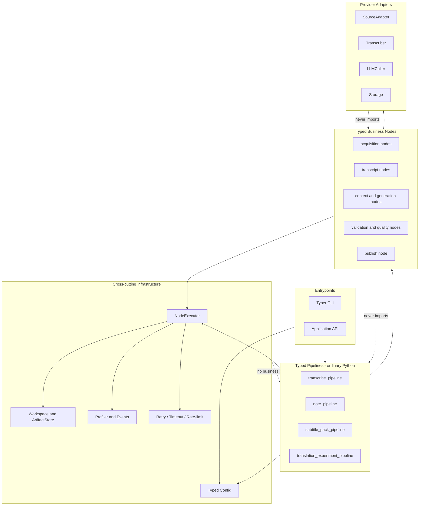
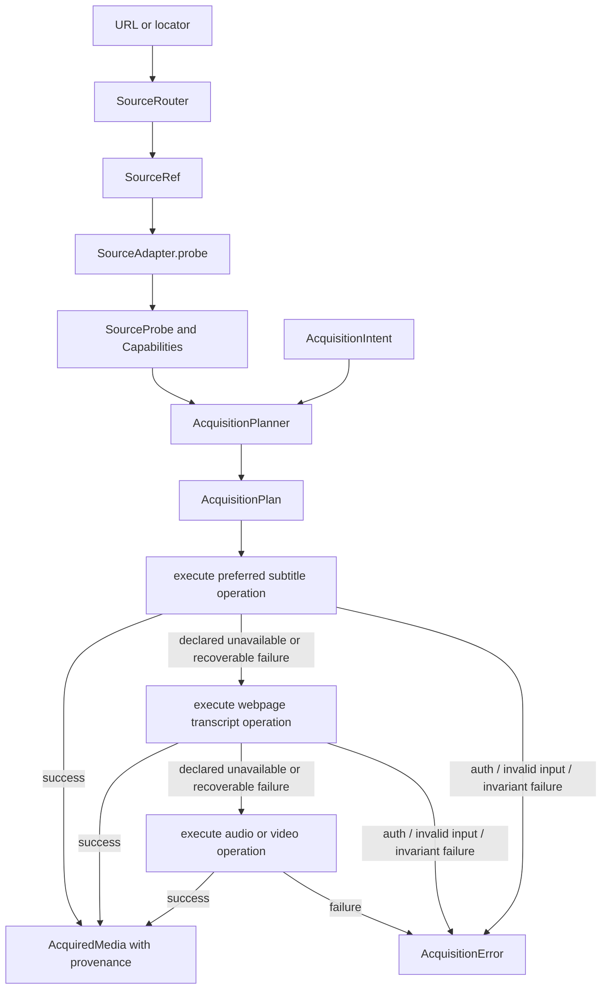
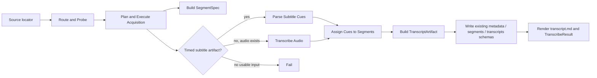
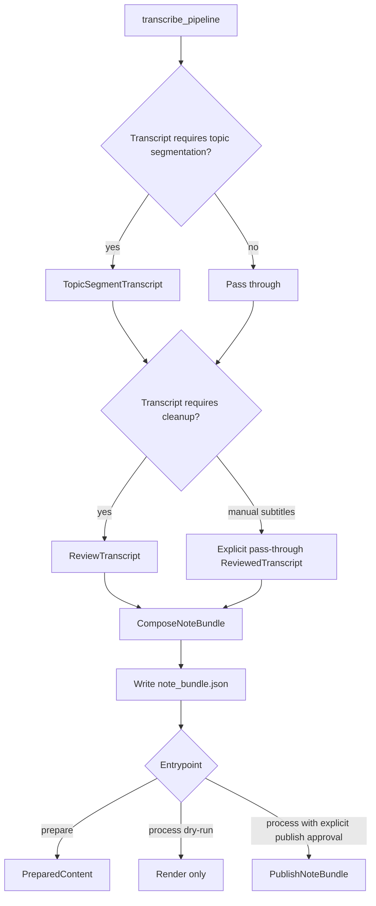
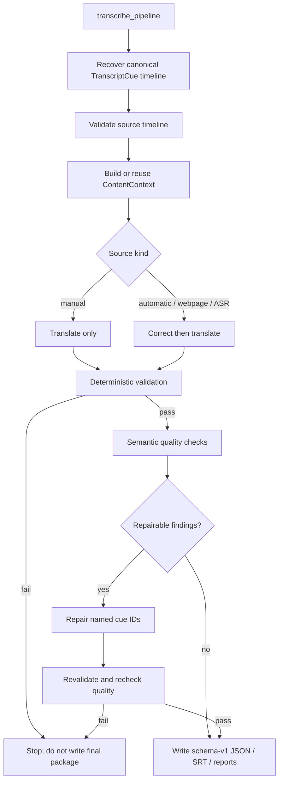
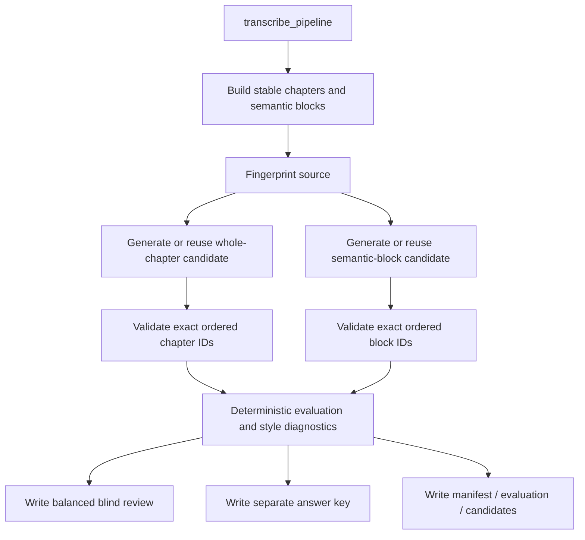
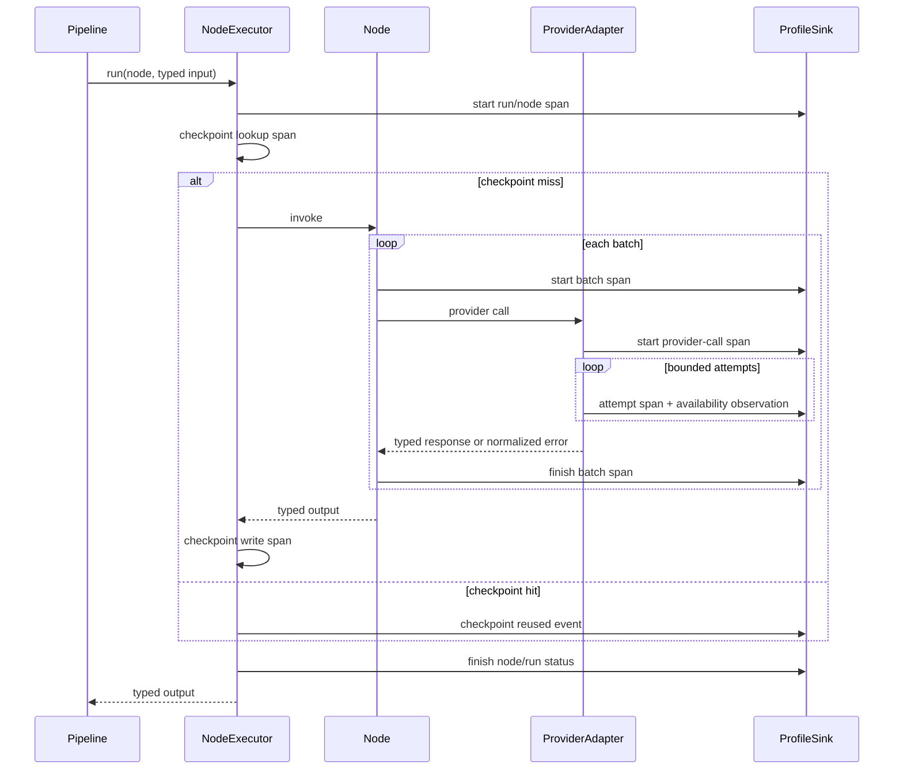
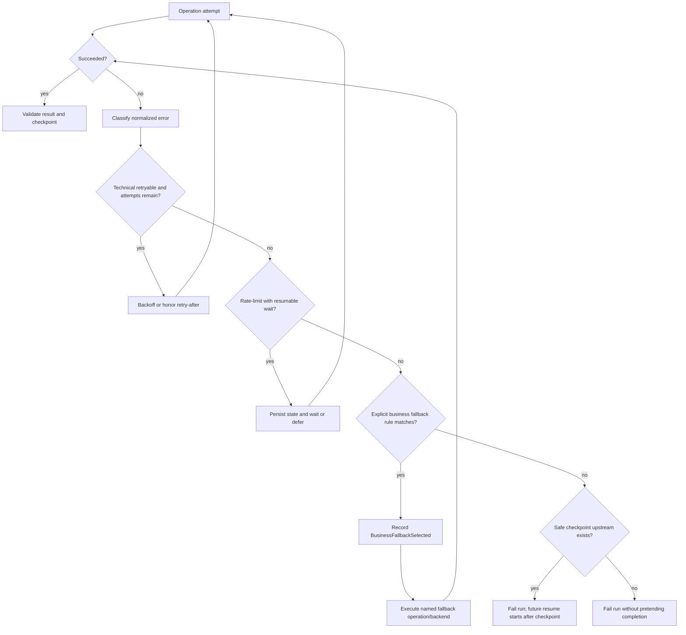

# yt2notion Typed Node / Typed Pipeline 目标架构设计

> **文档性质：目标 / 提议架构（Target / Proposed Architecture）**
>
> 本文描述尚未实现的 typed-node / typed-pipeline 重构方向，不代表当前代码行为或当前 artifact 契约。当前实现的唯一事实锚点仍是 [`PROJECT_MAP.md`](../PROJECT_MAP.md)。实施过程中只有已经落地的阶段才能同步进入 `PROJECT_MAP.md`。

## 1. 摘要

本设计把 yt2notion 从“应用服务串联一组 `list[dict]` 操作”演进为“入口函数用普通 Python 组合强类型节点”。它解决的是边界不清、反序列化后类型丢失、专项流程重复实现重试 / checkpoint / profiling，以及 provider 能力与业务决策耦合的问题。

核心选择：

- pipeline 是普通 Python 函数；分支使用 `if`，批处理使用 `for`，组合使用函数调用。
- node 是有明确输入、输出和错误契约的业务能力，不是工作流 DSL 的一个配置条目。
- provider adapter 负责外部系统操作；planner 根据 probe 结果与业务 intent 选择操作。
- `NodeExecutor` 统一执行观测、重试、checkpoint 和事件，但不决定业务顺序。
- 内存中使用 typed domain objects；artifact 边界由显式 codec 序列化 / 校验。
- 第一阶段保持现有 JSON 文件名与 schema，不以“大迁移”作为类型化前提。
- 自动测试全部离线，不调用 YouTube、ASR、LLM、Obsidian 或其他远程服务。

## 2. 背景与问题定义

当前架构已经具备若干良好边界：`MediaSource`、`Transcriber`、`LLMCaller`、`Storage` 使用 `Protocol`；subtitle-pack 有 typed cue、确定性校验、checkpoint identity 和 profile；translation experiment 也有 typed source / candidate contracts。

但主路径仍有四类结构性问题：

1. `segments.json`、`transcripts.json`、`reviewed.json`、ASR plan/state/chunks 在业务层以 `list[dict]` / `dict` 传播，字段所有权只能靠约定。
2. workspace 同时承担目录定位、artifact codec、状态恢复和部分清理策略，读出 JSON 后没有统一 ingress validation。
3. `Yt2Notion` 同时做 pipeline 编排、provider 创建、条件策略、计时、失败落盘和输出组装；专项流程又各自实现 profile / checkpoint。
4. 当前 `MediaSource.acquire()` 将 probe、subtitle 选择、webpage transcript 尝试、audio/video 下载和 fallback 组合在 provider 内，业务 intent 难以表达，也难以离线验证 planner 决策。

本设计不否定现有专项实现；它把其中已证明有效的模式收敛为清晰的共享边界。

## 3. 目标、非目标与原则

### 3.1 目标

- 用不可变或受控可变的 typed contracts 取代核心流程中的 `list[dict]`。
- 让每条 pipeline 的输入、输出、条件分支、side effect 和 publish 边界一眼可见。
- 把来源探测、业务规划和 provider 执行分开，使 fallback 可以被确定性测试。
- 为所有 node 提供一致的 run / node / batch / provider-call / attempt / checkpoint 观测层级。
- 统一 checkpoint identity、恢复规则、timeout / retry / rate-limit 策略，同时保留业务 fallback 的显式性。
- 初始迁移保持运行时行为和既有 JSON schema，降低回归面。
- 保持 source credit（频道、标题、URL）为所有面向用户输出的强制不变量。

### 3.2 非目标

- 不构建通用 DAG engine、scheduler、YAML workflow DSL 或动态 node registry。
- 不把 pipeline 顺序开放为用户配置。
- 不引入 hosted queue、数据库、分布式 worker、OpenTelemetry collector 或 circuit breaker。
- 不在本次重构中更改字幕优先级、ASR quota 语义、prompt、Obsidian bundle 内容或浏览器扩展 schema。
- 不通过兼容层永久保留废弃的内部 dict API；迁移完成后直接删除旧路径。
- 不增加 live YouTube / ASR / LLM 测试。

### 3.3 设计原则

1. **Python 即工作流语言**：可搜索、可调试、可类型检查，不复制 Python 已有控制流。
2. **类型只在可信边界后成立**：JSON、provider response 和 LLM response 必须先 decode + validate，再进入 domain。
3. **规划与执行分离**：planner 只产生确定性 plan，adapter 只执行 plan 中的 provider operation。
4. **机制与策略分离**：executor 提供 retry / checkpoint 机制；node 或 pipeline 声明可用策略。
5. **技术重试不等于业务 fallback**：同一 operation 的重试可统一；换来源、换 backend、降级产物必须由业务显式决定。
6. **side effect 默认窄化**：除 artifact store 和显式 publish node 外，node 返回值而不是隐式写外部系统。
7. **兼容发生在 codec，不污染 domain**：迁移期旧 JSON schema 由 codec 保持，domain 不保留旧字段别名。
8. **安全属性写死在代码**：idempotency、publish gate、凭据脱敏等不可被 YAML 关闭。

## 4. 分层架构与依赖方向



### 4.1 层职责

| 层 | 负责 | 不负责 |
|---|---|---|
| Entrypoints | 参数解析、配置解析、选择 pipeline、展示结果 | 业务分支、provider fallback、artifact schema |
| Typed Pipelines | 普通 Python 编排、条件分支、聚合最终 result、publish gate | provider 协议细节、JSON 读写细节、通用重试实现 |
| Typed Nodes | 单一业务能力、输入输出验证、业务不变量 | CLI、动态发现、跨 pipeline 调度 |
| Provider Adapters | 外部 API / CLI / 文件格式调用，错误归一化 | 决定何时 fallback、决定整个 pipeline |
| Cross-cutting | artifact、执行包装、观测、恢复、技术策略、配置 | 内容策略与业务顺序 |

依赖只能向下。provider adapter 返回 domain contract 或 provider observation，不返回可在业务层任意索引的原始 dict。

## 5. 核心 typed contracts 与所有权

建议使用 Python `dataclass(frozen=True)` 表示 domain value，`Enum` / `Literal` 表示有限状态，`Protocol` 表示 adapter 接口。需要增量构建的运行状态可以使用非 frozen dataclass，但只能由其 owner 修改。

### 5.1 来源与能力

| Contract | 关键字段 | Owner | 不变量 |
|---|---|---|---|
| `SourceRef` | `provider`, `locator`, `original_url`, `canonical_url` | `SourceRouter` | provider 已确定；保留用户原始 URL |
| `SourceMetadata` | `source_id`, `title`, `channel`, `url`, `duration`, `language`, `description`, `chapters` | source adapter codec | 用户输出所需 credit 字段始终存在；未知值显式为空 |
| `SubtitleTrack` | `track_id`, `language`, `kind`, `format` | source adapter | `kind ∈ {manual, automatic, webpage}` |
| `SourceCapabilities` | subtitle tracks、audio/video availability、webpage transcript capability | source adapter probe | 是一次带时间点的观察，不承诺未来一定可执行 |
| `SourceProbe` | `source`, `metadata`, `capabilities`, `observed_at` | `SourceAdapter.probe` | probe 不下载大媒体，不做业务 fallback |
| `ProviderAvailability` | provider、状态、原因、观察时间、有效期 | adapter / health service | observation，不作为永久真值 |

`SourceRef` 不应复用 `VideoMeta`：前者描述“如何定位来源”，后者的目标替代物 `SourceMetadata` 描述“probe 观察到什么”。这样 Bilibili、Podcast 或未来文件来源无需伪装成 YouTube video。

### 5.2 acquisition 意图、计划与产物

| Contract | 关键字段 | Owner | 不变量 |
|---|---|---|---|
| `AcquisitionIntent` | `need_timed_cues`, `need_audio`, `need_video`, `preferred_languages` | pipeline | 表达业务需要，不出现 yt-dlp 参数 |
| `AcquisitionOperation` | operation kind、输入 capability ref、目标 artifact kind | planner | 仅描述一个 provider operation |
| `FallbackRule` | failure category、下一 operation | planner | 只匹配明确错误类别，不捕获所有异常 |
| `AcquisitionPlan` | probe fingerprint、ordered operations、fallback rules | `AcquisitionPlanner` | 可离线重放；必须满足 intent 或显式不可满足 |
| `ArtifactProvenance` | provider、operation、source ref、track/backend、时间、parent artifacts | adapter / node | 每个 acquisition artifact 可追溯 |
| `AcquiredMedia` | metadata、subtitle/audio/video `ArtifactRef`、provenance | acquisition pipeline | 不用 `None` 的组合猜测路径来源；每个存在的 artifact 有 provenance |

`AcquisitionIntent` 的典型值：

- transcribe / note：需要可形成 transcript 的来源；默认不需要 video。
- subtitle-pack：优先需要原始 timed cues；只有无字幕来源时需要 audio。
- 用户显式 `keep_video=True`：额外要求 video，不能由 planner 擅自忽略。

### 5.3 transcript 与内容 contracts

| Contract | 关键字段 | Owner | 说明 |
|---|---|---|---|
| `SegmentSpec` | `id`, `title`, `start_ms`, `end_ms`, `parent_id` | segmentation node | 内容结构 / ASR 工作区间，不携带文本 |
| `TranscriptCue` | `id`, `start_ms`, `end_ms`, `text`, `origin`, `provenance` | subtitle parser / ASR node | 最小时间轴单位，可重叠；用于播放与精确追溯 |
| `TranscriptSegment` | `id`, `title`, `start_ms`, `end_ms`, `text`, `origin`, `cue_ids` | assignment / topic segmentation | 阅读和总结单位；可以聚合多个 cue |
| `TranscriptArtifact` | metadata ref、ordered cues、ordered segments、source summary、schema identity | transcription pipeline | cues 与 segments 角色不同，不再用同一种 dict 兼任 |
| `ContentContext` | source metadata、bounded global brief、section contexts、fingerprints | context node | 只含结构化上下文；不含 provider client |
| `ReviewedTranscript` | original artifact ref、reviewed segments、review policy | review node | manual source 可返回明确的 pass-through result |
| `NoteBundle` | source / guide / longform documents、tags、topics | note composition node | 延续现有 typed contract |

`TranscriptCue` 与 `TranscriptSegment` 必须分开：cue 的时间轴是 immutable playback evidence；segment 是可重新切分、校对和总结的业务视图。topic segmentation 只能改变 segments，不得改写 cues。

### 5.4 validation、quality 与 artifact contracts

| Contract | 关键字段 | 语义 |
|---|---|---|
| `ValidationIssue` | code、severity、location、message | 机器可判断的结构 / 不变量问题 |
| `ValidationReport` | `passed`, checks, issues | 确定性验证；失败通常阻断后续写最终 artifact |
| `QualityFinding` | rule/model、subject id、message、repairable | 内容质量发现，可来自 LLM 或规则 |
| `QualityReport` | deterministic report、semantic findings、repair summary | 质量结论；不得掩盖结构失败 |
| `ArtifactKey[T]` | logical name、codec、schema version | typed artifact 地址，不直接等同于文件名 |
| `ArtifactRef[T]` | key、path、content hash、size、provenance | 已持久化产物的引用 |
| `CheckpointIdentity` | node version、input hashes、config subset、provider identity、prompt hash、batch policy | 只有所有行为相关输入一致才可复用 |
| `PipelineResult` | source metadata、typed outputs、artifact refs、run id | entrypoint 返回；具体 pipeline 使用具体 result 类型 |

确定性 validation 与语义 quality 分离。LLM 不能判定 ID 覆盖、顺序、时间轴或 schema 是否正确；程序也不假装仅靠长度比判断翻译语义质量。

## 6. Node 模型与完整能力清单

### 6.1 Node 接口

概念接口如下，实际实现优先使用具名 callable class 或函数，不要求所有 node 继承同一个基类：

```python
InputT = TypeVar("InputT")
OutputT = TypeVar("OutputT")


class Node(Protocol[InputT, OutputT]):
    node_id: str
    version: int

    def __call__(self, value: InputT, context: NodeContext) -> OutputT: ...
```

`NodeContext` 只提供允许的横切能力（artifact store、事件、clock、run identity），不提供 service locator。依赖的 adapter 通过构造函数显式注入。对简单纯函数，直接由 executor 接受 metadata + callable，避免为统一外观制造类。

### 6.2 能力 / node inventory

| 能力 / Node | Typed Input | Typed Output | 底层依赖 | 严格边界 |
|---|---|---|---|---|
| `RouteSource` | URL / locator | `SourceRef` | explicit router rules | 只判断 provider；不联网、不探测内容 |
| `ProbeSource` | `SourceRef` | `SourceProbe` | `SourceAdapter.probe` | 轻量观察；不下载大媒体 |
| `PlanAcquisition` | `SourceProbe`, `AcquisitionIntent` | `AcquisitionPlan` | pure policy | 不调用 provider；确定性 |
| `ExecuteAcquisition` | plan | `AcquiredMedia` | `SourceAdapter.execute`, artifact store | 仅执行 plan；fallback 只能按 plan |
| `ParseSubtitleCues` | subtitle artifact + provenance | tuple of `TranscriptCue` | SRT/VTT parser | 不做翻译、review 或 segment policy |
| `BuildSegmentSpecs` | metadata + segmentation config | tuple of `SegmentSpec` | chapter/description parser | 不读取 audio，不生成 transcript text |
| `TranscribeAudio` | audio artifact + specs | cues + ASR execution report | `Transcriber`, audio splitter | ASR provider fallback 由显式 policy 驱动 |
| `AssignCuesToSegments` | cues + specs | segments | pure algorithm | 不调用 LLM |
| `BuildTranscriptArtifact` | cues + segments + metadata | `TranscriptArtifact` | pure validation | 统一 origin/provenance；不持久化外部服务 |
| `TopicSegmentTranscript` | artifact + threshold | updated segments | `LLMCaller` when needed | cues 不变；输出精确引用原 segment/cue |
| `ReviewTranscript` | artifact / reviewed input | `ReviewedTranscript` | `LLMCaller` | manual subtitle policy显式 pass-through |
| `ComposeNoteBundle` | reviewed transcript + metadata | `NoteBundle` | `Summarizer` / `LLMCaller` | 必须保留 source credit；不发布 |
| `PublishNoteBundle` | bundle + metadata + publish token | publish receipt | `Storage` | 唯一外部 publish node；不可被 prepare 调用 |
| `BuildSubtitleContext` | transcript artifact + metadata | `ContentContext` | `LLMCaller`, checkpoint | bounded；identity 含 prompt/model/source |
| `GenerateBilingualCues` | cues + context + source kind | bilingual cues | `LLMCaller`, batch policy | 不允许模型拥有 ID / timing |
| `ValidateSubtitlePack` | source + generated cues | `ValidationReport` | pure rules | 精确顺序、覆盖、时间轴、非空检查 |
| `CheckSubtitleQuality` | bilingual cues + context | `QualityReport` | `LLMCaller` + rules | 语义 findings 不替代 deterministic validation |
| `RepairSubtitleFindings` | cues + repairable findings | revised cues | `LLMCaller` | 只改指定 ID；之后必须复验 |
| `WriteSubtitlePack` | validated package | artifact refs | artifact codecs | validation 未通过不得写 final package |
| `BuildExperimentSource` | transcript artifact | chapters + blocks | pure splitter | 稳定 ID；不调用 LLM |
| `GenerateExperimentCandidate` | source + strategy | candidate | `LLMCaller`, checkpoint | 一次 strategy 一种明确 contract |
| `EvaluateExperiment` | source + candidates | evaluation + blind package | pure gates + style diagnostics | answer key 与 blind review 分离 |

不是所有 helper 都是 node。JSON parsing、hashing、文本清理、batch slicing、SRT formatting 是 node 内部函数或 codec；只有具有独立业务输入输出、策略或可恢复执行意义的能力才成为 node。

## 7. Acquisition 子系统

### 7.1 四个角色

1. **`SourceRouter`**：把用户 locator 转成 `SourceRef`。路由依据是 provider 能否识别 locator，不根据 URL 字符串直接推断字幕是否存在。
2. **`SourceAdapter.probe()`**：获取 metadata 和 capabilities。它可以调用 provider 的 metadata endpoint / CLI，但不做大文件下载。
3. **`AcquisitionPlanner`**：结合 `SourceProbe`、`AcquisitionIntent` 和静态业务规则，返回 ordered `AcquisitionPlan`。
4. **`SourceAdapter.execute()`**：执行 subtitle/audio/video/webpage-transcript 等 provider operation，返回带 provenance 的 artifact 或归一化错误。



### 7.2 显式 fallback 语义

fallback 不是 `except Exception: try something else`。每条 rule 必须声明：

- from operation；
- 可触发的 `ErrorCategory`；
- next operation；
- 是否保留前一步 artifact；
- 是否记录 degraded provenance；
- 是否仍满足原始 intent。

例如 subtitle 下载失败时，只有 `CapabilityStale`、`NotFound`、可恢复 provider 错误才能进入 webpage/audio fallback。认证失败、无效 URL、磁盘写入失败和 schema/invariant 错误直接失败，不得伪装成“没有字幕”。

### 7.3 为什么 subtitle / audio / video 保持 provider operation

这些操作是同一来源 provider 的不同获取方式，不是独立业务变换：

- 都依赖 provider locator、cookie、format selector 和下载语义。
- 它们共享 probe capability 与 provider error taxonomy。
- 将其注册成业务 nodes 会泄漏 yt-dlp 参数到 pipeline，并诱导出动态 DAG。
- 业务真正关心的是“获得 timed cues / audio / video”，而不是执行了哪个 CLI flag。

因此，`ExecuteAcquisition` 是业务 node；它内部按 `AcquisitionPlan` 调用多个明确的 provider operations，并逐次产生 provider-call / attempt spans。

## 8. Typed Pipelines

### 8.1 Transcribe pipeline



行为保持：字幕优先；无字幕才启动 ASR；captioned input 不创建 transcriber；`keep_video` 仅改变 acquisition intent；transcribe 在 transcript artifacts 后停止。

### 8.2 Note prepare / process pipeline



`prepare` 和 `process` 共享同一个 note pipeline，但 publish 是最后一个显式调用，不是 pipeline 配置开关。发布安全规则见第 9.8 节。

### 8.3 Subtitle-pack pipeline



现有 `bilingual_subtitles.json` schema-v1、source cue stable IDs、manual source 不改写、generation batch budget 和 overlap identity 在初始迁移中保持不变。

### 8.4 Translation-experiment pipeline



重构后 experiment 直接接收 `TranscriptArtifact` 或其 `segments` typed view，删除 `cast("list[CanonicalTranscript]", transcripts)`。它仍只写本地 artifact，不依赖 `Storage`。

## 9. 横切设计

### 9.1 Workspace 与 ArtifactStore

`Workspace` 只负责一个 source workspace 的路径、锁和生命周期；`ArtifactStore` 负责 typed artifacts：

```python
T = TypeVar("T")


class ArtifactStore(Protocol):
    def write(self, key: ArtifactKey[T], value: T, provenance: ArtifactProvenance) -> ArtifactRef[T]: ...
    def read(self, key: ArtifactKey[T]) -> T | None: ...
    def inspect(self, key: ArtifactKey[object]) -> ArtifactMetadata | None: ...
```

每个 `ArtifactKey` 绑定 codec；codec 承担 schema validation、domain ↔ JSON 转换和原子写入。初始 codec 必须生成与当前相同的：

- `metadata.json`
- `segments.json`
- `transcripts.json`
- `reviewed.json`
- `transcribe_plan.json`
- `transcribe_state.json`
- `transcribe_chunks/*.json`
- `note_bundle.json`
- subtitle-pack、translation-experiment 和 profile 既有文件

媒体文件通过 binary artifact API 管理，不被 JSON codec 包装。写入采用 temp file + flush + atomic replace；final artifact 只有在完整验证后出现。

### 9.2 NodeExecutor

统一 executor 的职责：

- 创建 node span 与事件；
- 计算 checkpoint identity 并判断 hit / miss / invalid；
- 应用 node 声明的 timeout / retry policy；
- 捕获并归一化技术错误，但不吞掉业务错误；
- 在成功后原子写 checkpoint；
- 在失败 / 中断时结束 span 并写 run failure；
- 注入 clock / sleeper，保证离线可测试。

它明确不负责：拓扑排序、动态 node lookup、业务 fallback、自动并行化和 publish 决策。

### 9.3 Profiler span 模型



层级固定为：

`run → node → batch → provider-call → attempt`，`checkpoint` 是 node 下的独立 span；不适用的层可省略。每个 span 至少包含 ID、parent ID、operation、status、elapsed、input/output size（仅数量，不含正文）、provider/model/backend label、retry / checkpoint 标记和 error category。禁止记录 prompt、字幕正文、API key、cookie 和完整 provider response。

### 9.4 Progress 与事件

`ProgressEvent` 从当前 callback 的 `(step, literal, message)` 演进为 typed event：

- `RunStarted/Completed/Failed`
- `NodeStarted/Completed/Skipped/Failed`
- `BatchStarted/Completed`
- `AttemptScheduled/Started/Failed`
- `RateLimitWaitStarted/Completed`
- `BusinessFallbackSelected`
- `CheckpointHit/Miss/Invalidated/Written`
- `PublishStarted/Completed/Failed`

CLI renderer 消费事件并输出人类文本；JSON/event sink 可以写结构化记录。node 不直接 `typer.echo()`。

### 9.5 Checkpoint identity 与 resume

统一 identity 必须包含所有会影响输出的输入：

- node ID + node contract version；
- ordered input artifact content hashes；
- 影响行为的 typed config subset；
- provider/backend/model identity；
- prompt fingerprint；
- batch budget、overlap、language、strategy 等 node policy；
- output schema version。

不包含 workspace 绝对路径和 run ID，避免同内容无法复用。命中 checkpoint 前，codec 仍需验证 payload 与 expected IDs；文件存在不等于有效。

`resume_from` 的目标语义是“从指定 node 起强制重算，其后按新 identity 判断”，而不是手动猜测要删除哪些文件。第一阶段为保持 CLI 行为，可由 compatibility mapping 将现有 step 名映射到 node IDs。

### 9.6 Provider availability observations

availability 是一次有 TTL 的被动或主动 observation：

- provider call 成功：记录 available。
- 连接失败、timeout、quota response：被动记录 unavailable / rate-limited 及 retry time。
- 显式启动或人工诊断：可运行主动 health check。
- observation 只辅助当前 run 的决策，不写成“永久禁用 provider”的配置。

planner 主要根据 probe capability 规划；executor / adapter 在执行时根据最新 observation 实施技术等待，pipeline 才能选择业务 fallback。

### 9.7 Health check

**被动检查优先**：真实调用本身就是最准确的健康信号。不要在每个 provider call 前先发 health request，这会增加延迟、负载、失败面，并产生 TOCTOU（检查后仍可能失败）。

主动 health check 只用于：

- run 启动时针对需要自托管、且配置为 restart-on-unhealthy 的 provider 检查一次；
- provider restart 后等待 readiness；
- 用户显式 `doctor` / diagnostics；
- 长时间 rate-limit wait 结束后、provider 明确要求时。

当前 remote ASR “每个 adapter 生命周期只检查一次”的行为应被保留并移到统一 observation 模型，而不是扩大成每个 chunk 检查。

### 9.8 Idempotency 与 publish safety

以下安全属性由代码固定，不允许 YAML 覆盖：

- acquisition / transformation nodes 对相同 identity 可安全恢复；final artifact 原子替换。
- LLM / ASR node 的可重试性基于“未观察到已接受结果”及 checkpoint；不假设 provider 请求天然 exactly-once。
- `prepare`、`transcribe`、subtitle-pack、experiment 永远不能调用 `PublishNoteBundle`。
- publish node 默认不自动重试，因为三文件写入可能部分成功且现有 Storage 没有 transaction / idempotency key。
- `process` 必须持有 entrypoint 创建的 `PublishAuthorization`（来自用户显式命令语义），typed config 不能构造它。
- dry-run 路径在类型和控制流上绕过 publish node。
- publish receipt 记录目标和完成文件；未来若 Storage 支持原子 commit / idempotency key，再单独放宽重试。

## 10. Error taxonomy、retry 与恢复

### 10.1 Error taxonomy

| 类别 | 例子 | 默认处理 |
|---|---|---|
| `InvalidInputError` | 无效 URL、空字幕、非法 CLI 参数 | 立即失败 |
| `ConfigurationError` | backend 未知、缺少凭据、冲突配置 | 运行前失败 |
| `CapabilityUnavailableError` | probe 明确无字幕 / audio | 由 acquisition plan 选择下一 operation |
| `ProviderAuthError` | 401/403、cookie 失效 | 立即失败，不 fallback 掩盖 |
| `ProviderNotFoundError` | track 已消失、资源 404 | 仅按 plan 的 capability-stale rule fallback |
| `TransientProviderError` | 连接重置、5xx、临时空输出 | bounded retry |
| `ProviderTimeoutError` | subprocess / HTTP timeout | 若 operation 可重试则 bounded retry |
| `RateLimitError` | hourly quota + retry-after | checkpoint 状态后等待或 defer |
| `QuotaExhaustedError` | daily quota | 显式业务 fallback backend 或失败 |
| `ContractViolationError` | provider / LLM 输出 schema 错 | 通常立即失败；可对 LLM 做极小 bounded regeneration |
| `ValidationError` | ID / 顺序 / timeline 不符 | 阻断 final artifact；显式 repair 后复验 |
| `ArtifactCorruptionError` | hash / JSON / schema 不符 | checkpoint invalid；可从安全上游重算 |
| `LocalResourceError` | 磁盘满、权限错误、ffmpeg 缺失 | 立即失败 |
| `PublishError` | Obsidian 部分写入 | 失败并报告 receipt / partial state；不盲重试 |
| `CancelledError` | Ctrl-C / cancellation | 保存已完成 checkpoint，run 标记 cancelled |

### 10.2 Retry matrix

| Operation | 可重试错误 | 次数 / 等待 | 不重试 | 业务 fallback |
|---|---|---|---|---|
| source probe | transient / timeout | 小次数短 backoff | auth、invalid input | 无；probe 失败即失败 |
| subtitle/webpage/audio/video execute | transient / timeout | bounded | auth、local resource、contract | 仅 acquisition plan 声明的下一 operation |
| LLM call | timeout、明确 transient、空输出 | config bounded attempts | parse 后确定性 invariant failure默认不盲重试 | node 可显式 regeneration / repair，不换内容策略 |
| ASR chunk | transient / timeout | adapter policy | invalid audio、auth | hourly wait；daily quota 可切显式 fallback backend |
| checkpoint read | 无 | 无 | corruption | 标记 invalid 后从 node 重算 |
| artifact write | 无盲重试 | 可重做原子 replace 前步骤 | disk / permission | 无 |
| publish | 默认无 | 0 | 所有不确定结果 | 无自动 fallback |

### 10.3 Retry / recovery 决策流



技术 retry 在同一 operation、同一语义输入内进行。业务 fallback 改变 operation / provider / source quality，必须留下 event、provenance 和最终 backend attribution。

## 11. 配置结构与优先级

### 11.1 目标结构

配置首先 decode 成 typed dataclasses；业务代码不接收原始 `dict`。建议分组：

```yaml
source:
  backend: yt_dlp
  subtitle_priority: [zh-Hans, zh-Hant, en]
  auto_subtitle_fallback: true
  cookies_from: chrome

transcription:
  primary_backend: groq
  fallback_backend: remote
  chunk_duration_seconds: 120
  providers:
    groq: { ... }
    remote: { ... }

models:
  backend: codex_cli
  roles:
    review: gpt-5.4
    translate: gpt-5.4
  timeout_seconds: 240
  max_attempts: 1

content:
  target_language: zh-CN
  max_segment_seconds: 900
  long_content_threshold_seconds: 1800

storage:
  backend: obsidian
  obsidian: { ... }

workspace:
  base_dir: ./workspace
```

这是目标结构，不要求第一阶段改 YAML。迁移初期可由 config codec 把当前字段转换为 typed config，保持现有 `config.yaml` 有效；项目不承诺长期兼容尚未发布的旧内部结构，真正切换时一次更新样例和事实文档。

### 11.2 优先级

从高到低：

1. CLI 显式参数（仅允许被 entrypoint 暴露的字段）；
2. CLI 显式 `--config` 文件；
3. `~/.yt2notion-agent/config.yaml`；
4. 当前仓库 `config.yaml`；
5. 代码内默认值；
6. 环境变量只补充 secret 或文档明确允许的 provider endpoint，不覆盖任意业务字段。

一个 run 只选择一个 config file，再与 defaults 合并；不把 user config 与 project config 逐层叠加，避免来源不可解释。最终生成 `ResolvedConfig`，profile 只记录非敏感 config fingerprint 与安全字段。

### 11.3 不可配置的安全属性

以下不进入 YAML：

- 哪些 pipeline 允许 publish；
- publish 是否自动 retry；
- source credit 是否可删除（现有 `always_include` 最终应收敛为固定 true）；
- checkpoint 是否可以跳过 schema/hash/ID 校验；
- profiler 是否记录 prompt / 正文 / secret；
- LLM 是否可以改变 cue ID / timing；
- final artifact 是否允许在 validation 失败后写入。

## 12. 离线 contract testing 策略

测试金字塔以 pure contract tests 为主，所有 provider 都使用 fake / recorded minimal fixture；不启动网络，不依赖本机登录态，不访问真实 vault。

### 12.1 Adapter contract tests

对每个 `SourceAdapter`：

- probe 将 provider fixture 映射成相同的 `SourceProbe` 语义；
- execute 对每种 operation 生成正确 artifact 与 provenance；
- 401/404/5xx/timeout 被归一化为正确 error category；
- subtitle capability stale 不被错误归类为认证失败；
- 禁止在 probe 下载媒体。

对 `Transcriber` / `LLMCaller` / `Storage`：

- typed request / response mapping；
- timeout 与错误归一化；
- payload 不泄漏到 profile；
- storage 使用临时目录验证 partial publish 报告，不连接真实 Obsidian。

### 12.2 Planner contract tests

使用表驱动测试覆盖不对称输入：

- manual + automatic 同时存在时选择 manual priority；
- capability 宣称字幕但 execute stale 时进入指定 fallback；
- subtitle-pack 需要 timed cues，普通 webpage text 不满足时继续 audio；
- `keep_video=False` 不下载 video，`True` 时必须计划 video；
- auth error 不触发“无字幕”fallback；
- 无可满足方案返回 typed planning failure。

### 12.3 Node contract tests

- 每个 node 对 typed input 产生 typed output，并验证关键不变量。
- `TranscriptCue` overlap 合法但乱序非法；`TranscriptSegment` 可以重切但 cue 不变。
- manual review pass-through 与 auto / ASR review 路径都覆盖。
- LLM fake 返回漏 ID、重复 ID、乱序 ID、空文本时必须失败。
- note / subtitle / transcript 输出都包含 title、channel、URL source credit。

### 12.4 Pipeline contract tests

- transcribe：subtitle 与 ASR 两条分支、transcriber lazy init、artifact schema snapshot。
- prepare/process：manual skip、topic/review 条件、dry-run 不 publish、显式 process 才 publish。
- subtitle-pack：manual translate-only、auto/ASR correct-then-translate、repair 后复验、失败不写 final package。
- experiment：两策略各一次逻辑生成、checkpoint reuse、blind mapping、无 Storage 依赖。

### 12.5 Executor / profiler / retry / checkpoint tests

- fake clock + fake sleeper 精确断言 backoff / retry-after，不真实等待。
- span parent-child、失败 / cancellation status、attempt 数和 checkpoint hit/miss。
- prompt / content / secret 永不出现在 serialized profile。
- 任一 identity 字段变化都 invalidates checkpoint；无关绝对路径变化不 invalidates。
- 损坏 checkpoint 被标记 invalid 并安全重算。
- 技术 retry 不触发业务 fallback event；fallback 必须由明确 rule 触发。
- health check 每 adapter lifecycle 至多一次，普通 provider call 前不额外检查。

### 12.6 明确禁止的自动测试

- live YouTube / Bilibili 下载；
- live Groq / remote ASR；
- live Claude / Codex / Anthropic；
- 写真实 Obsidian vault；
- 依赖用户 cookie、API key 或 `~/.yt2notion-agent/config.yaml`。

真实媒体验证若未来需要，只作为人工验收记录，不属于 CI contract suite。

## 13. 增量迁移计划

迁移遵循“先建立 codec 与类型，再移动 ownership，最后切 pipeline”的顺序。每个阶段都保持 CLI 和现有 JSON schema 可用；同一阶段不同时做行为优化。

### Phase 0：行为 characterization 与边界冻结

**改动**：补齐当前关键 artifact schema fixtures、pipeline 分支 tests、publish safety tests；记录现有 output。

**验收**：

- 当前 `transcribe`、`prepare/process`、subtitle-pack、experiment 的离线行为均有 contract tests。
- fixtures 覆盖 manual subtitle、automatic subtitle、ASR、quota fallback。
- 未改变生产代码行为。

### Phase 1：核心 contracts + codecs（首个交付目标）

**改动**：引入 `SegmentSpec`、`TranscriptCue`、`TranscriptSegment`、`TranscriptArtifact`、origin / provenance；为现有 JSON 实现 codecs；让 workspace typed read/write API 返回 domain objects。

**优先消除**：

- preparation、transcription、workspace、note composition 主路径的核心 `list[dict]`；
- translation experiment 的 `cast("list[CanonicalTranscript]", transcripts)`；
- subtitle-pack 从 transcript fallback 读取时的 unchecked dict access。

**验收**：

- core pipeline public / internal boundaries 不再传 `list[dict]`。
- experiment 接收 typed transcript，不含 cast。
- `metadata.json`、`segments.json`、`transcripts.json`、`reviewed.json` 字节级格式可有无关缩进差异，但 JSON 结构与字段保持兼容。
- 全量离线 tests 与 lint 通过。

### Phase 2：Acquisition split

**改动**：将当前 `MediaSource.acquire()` 拆为 router、adapter probe / execute、planner 和 acquisition orchestrator；先只提供 `YtDlpSourceAdapter`。

**验收**：

- planner 可用纯 fixture 完整测试，无网络。
- subtitle → webpage transcript → audio/video fallback 只由 plan 描述。
- auth / local resource failure 不再被 broad exception 当作无字幕。
- artifact 文件名与 CLI 行为不变。

### Phase 3：ArtifactStore + unified execution infrastructure

**改动**：引入 typed `ArtifactKey` / codecs、`NodeExecutor`、统一 events/profile、retry policy 与 checkpoint identity；先迁移 subtitle-pack / experiment 已有机制。

**验收**：

- 所有新 spans 有正确 parent hierarchy；失败与 Ctrl-C 可见。
- subtitle-pack schema-v1 与 experiment schema-v3 保持。
- checkpoint reuse 条件不比当前宽松。
- profile 不含内容 / secret；旧 profile 若需保留仅作为 reader fixture，不建立长期双写。

### Phase 4：主 typed pipelines

**改动**：实现四条普通 Python pipeline；将 `Yt2Notion` 缩为依赖组装和向 pipeline 转发；删除 `ContentPreparation` god-object 式聚合。

**验收**：

- pipeline 源码直接展示顺序和条件，不依赖 registry / YAML。
- transcribe、prepare/process 的行为与 Phase 0 fixtures 一致。
- `prepare` 类型上无法触达 publish authorization；dry-run 零 publish calls。
- resume mapping 和 failure artifacts 继续可用。

### Phase 5：收口与删除旧路径

**改动**：删除 dict API、旧 profile/checkpoint helper、重复 factory wiring 和废弃 compatibility mapping；更新 `PROJECT_MAP.md` 为已实现事实，同时同步索引文档。

**验收**：

- `rg 'list\[dict'` 只允许出现在明确的 JSON / provider raw codec 层，且有注释说明。
- 无 translation experiment casts、无 pipeline raw config dict。
- factories 仍是显式 backend 分支，不引入动态 registry。
- 文档、CLI help、配置样例与实现一致。

## 14. 建议模块布局

这是目标 ownership，不要求一次性移动所有文件：

```text
src/yt2notion/
├── entrypoints/
│   └── cli.py
├── pipelines/
│   ├── transcribe.py
│   ├── notes.py
│   ├── subtitle_pack.py
│   └── translation_experiment.py
├── domain/
│   ├── source.py
│   ├── acquisition.py
│   ├── transcript.py
│   ├── content.py
│   ├── validation.py
│   └── artifacts.py
├── nodes/
│   ├── acquisition.py
│   ├── transcription.py
│   ├── preparation.py
│   ├── notes.py
│   ├── subtitles.py
│   ├── experiments.py
│   └── publish.py
├── providers/
│   ├── source/base.py
│   ├── source/ytdlp.py
│   ├── asr/...
│   ├── llm/...
│   └── storage/obsidian.py
├── runtime/
│   ├── executor.py
│   ├── events.py
│   ├── profile.py
│   ├── retry.py
│   ├── checkpoint.py
│   └── health.py
├── artifacts/
│   ├── store.py
│   └── codecs.py
└── config/
    ├── models.py
    └── loader.py
```

迁移时优先按 ownership 拆分，不为目录美观做机械搬家。现有 `subtitle_pack/`、`translation_experiment/` 可先保留，在 Phase 5 再决定是否并入 nodes；只有职责真正共享时才抽取。

## 15. 架构不变量与验收总表

| 不变量 | 验证方式 |
|---|---|
| pipeline 使用普通 Python composition | 代码审查；无 DAG runtime / workflow YAML |
| core domain 无 `list[dict]` | type check / `rg` allowlist |
| ingress JSON / provider response 先 validate | codec / adapter contract tests |
| cue timeline 不被 topic/review/LLM 修改 | asymmetric timeline tests |
| fallback 必须显式 | planner table tests + fallback event |
| 不在每次 call 前 health-check | adapter lifecycle call-count test |
| checkpoint identity 完整 | mutation matrix tests |
| prepare / experiment / subtitle-pack 不 publish | fake Storage call-count = 0 |
| publish 不自动 retry | partial-write test |
| source credit 永远存在 | artifact / renderer contract tests |
| 初始 JSON schema 保持 | fixture round-trip / schema snapshot |
| 自动测试无远程服务 | network-deny fixture / fake adapters |

## 16. 已决策边界、开放决策与未来工作

### 16.1 本设计已决定

- 使用普通 Python pipeline，而不是通用 workflow runtime。
- 使用 explicit factories，而不是 dynamic registry。
- `SourceAdapter` 暴露 probe / execute，`AcquisitionPlanner` 负责选择。
- provider operations 不是独立业务 nodes。
- `NodeExecutor` 提供机制但不拥有拓扑。
- 首个实现目标是去除核心 `list[dict]` 和 experiment cast，且保持 JSON schema。
- 只做离线 contract tests。

### 16.2 开放决策与未来工作

- **通用 workflow runtime / DAG**：只有需要用户定义 pipeline、跨进程调度或多 pipeline 动态组合时。
- **Hosted queue / database**：只有单机 workspace 无法满足并发、租约、集中查询或多 worker 恢复时。
- **OpenTelemetry export**：只有需要跨服务 trace 或已有 collector；当前 span model 应可映射但不依赖 SDK。
- **Circuit breaker**：只有 provider 故障在大量并发 run 中造成放大；单进程低并发下 availability observation + bounded retry 足够。

这些均不属于当前 typed-node / typed-pipeline 重构范围。

## 17. 与当前实现的映射

| 当前实现 | 目标归属 |
|---|---|
| `application.Yt2Notion` | entrypoint wiring + 调用 typed pipelines |
| `MediaSource.acquire()` | router + probe + planner + execute acquisition |
| `ContentPreparation` | segmentation / policy / review / composition nodes |
| `TranscriptionEngine` | audio transcription node + ASR provider policy（逐步拆分） |
| `Workspace` | workspace locator + `ArtifactStore` |
| `subtitle_pack.ProfileRecorder` | runtime profiler sink |
| subtitle / experiment checkpoint helpers | runtime checkpoint store + node-specific identity fields |
| `retry.retry()` | runtime retry executor with typed policy / events |
| `VideoMeta` | `SourceMetadata`（迁移期 codec 保持 metadata.json） |
| `SubtitleEntry` / `SourceCue` | 统一为 `TranscriptCue`，输出 codec 保持专项字段 |
| transcript `list[dict]` | `TranscriptArtifact.segments` |
| `Storage.save_note_bundle()` | provider adapter behind explicit publish node |

此映射用于规划迁移，不表示必须按名称一一重命名。最终名称应以 ownership 清楚、调用端简洁为准。
